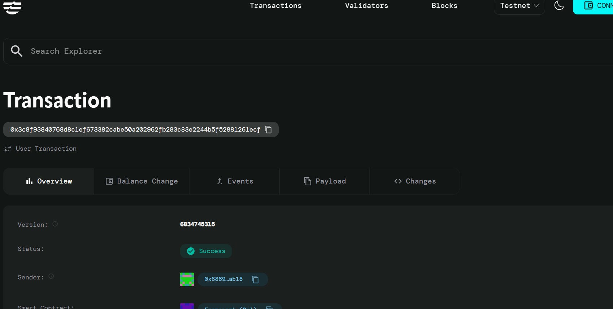

 # Insurance Pool Contract

## Project Description

The Insurance Pool Contract is a decentralized mutual insurance platform built on the Aptos blockchain using Move programming language. This smart contract enables community members to pool their resources together to provide financial protection against unforeseen events through a transparent, automated claim assessment mechanism.

The contract facilitates a peer-to-peer insurance model where participants contribute premiums to a shared pool and can file claims when they experience covered losses. The system includes basic claim validation and automated fund distribution, ensuring fair and efficient insurance operations without traditional intermediaries.

## Project Vision

Our vision is to democratize insurance by creating a transparent, community-driven platform that:

- **Eliminates Traditional Barriers**: Remove the need for centralized insurance companies and their associated overhead costs
- **Promotes Financial Inclusion**: Provide accessible insurance services to underserved communities worldwide
- **Ensures Transparency**: Leverage blockchain technology to create an immutable record of all transactions and claims
- **Builds Trust**: Implement automated smart contract logic that executes claims fairly and consistently
- **Fosters Community**: Create a mutual support system where members collectively share risks and benefits

## Key Features

### 🏊‍♂️ **Pooled Risk Management**
- Community members contribute premiums to a shared insurance pool
- Risk is distributed among all pool participants
- Transparent tracking of total premiums and claims

### 💰 **Automated Premium Collection**
- Seamless premium payment through AptosCoin integration
- Automatic pool balance updates
- Member enrollment with premium payment verification

### ⚖️ **Smart Claim Assessment**
- Automated claim validation based on predefined criteria
- Multi-factor assessment including member status and pool capacity
- Instant claim processing for eligible members

### 📊 **Real-time Pool Analytics**
- Live tracking of pool statistics (total premiums, claims, members)
- Transparent financial health indicators
- Member contribution and claim history

### 🔐 **Decentralized Governance**
- Smart contract-based claim processing eliminates human bias
- Immutable transaction records on Aptos blockchain
- Community-owned insurance model

### 💡 **Flexible Pool Configuration**
- Customizable claim thresholds for risk management
- Scalable architecture supporting multiple insurance pools
- Adaptable premium and claim structures

## Future Scope

### Phase 1: Enhanced Assessment Mechanisms
- Implement more sophisticated claim validation algorithms
- Add multi-signature approval processes for large claims
- Integrate oracle services for external data verification

### Phase 2: Advanced Risk Management
- Introduce risk scoring based on member profiles
- Implement dynamic premium adjustments
- Add catastrophic event protection mechanisms

### Phase 3: Expanded Coverage Options
- Support for multiple types of insurance (health, property, life)
- Cross-chain compatibility for broader adoption
- Integration with DeFi protocols for yield generation

### Phase 4: Governance and DAO Features
- Community voting on claim disputes
- Member governance for policy changes
- Incentive mechanisms for active participation

### Phase 5: Enterprise Integration
- API development for third-party integrations
- Mobile application for easier access
- Partnership with traditional insurance providers

### Phase 6: Global Expansion
- Multi-currency support
- Regulatory compliance frameworks
- Localization for different markets

## Contract Details
0x3c8f93840768d8c1ef673382cabe50a202962fb283c83e2244b5f52881261ecf
